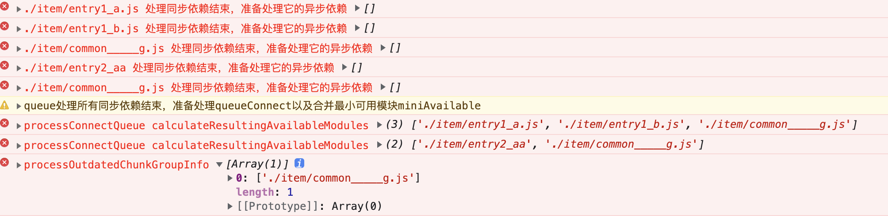

## 步骤一
npm install

## 步骤二
使用提供的buildChunkGraph.js覆盖node_modules对应的buildChunkGraph.js

## 步骤三

npm run build即可开始断点调试 
测试processConnectQueue() + processChunkGroupsForMerging() + processOutdatedChunkGroupInfo()

在断点中可以看到最终会取读对应的并集获取依赖`./item/common_____g.js`

可以参考图片